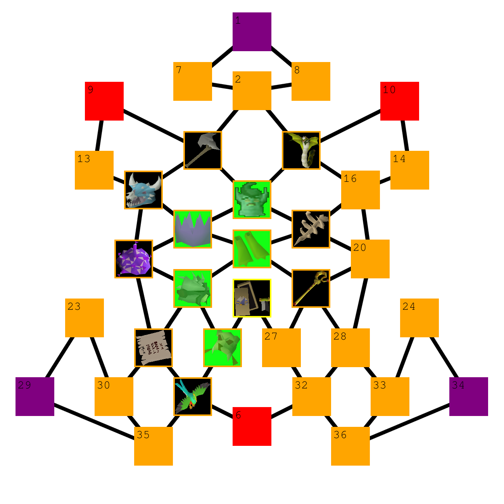

# Tectonic Turtle Bingo

A Discord bot for running the Tectonic clan's OSRS bingo event. Instead of a regular 5x5 card, the board is a graph of 36 tiles. Each team starts with a few tiles unlocked, and finishing a tile unlocks the ones next to it.

Players submit drops, CAs, minigame kills and so on with a screenshot as proof. A moderator accepts or denies the submission. Accepted ones count toward the tile, and newly unlocked tiles show up for the team straight away.

<p align="center">
  
</p>

## How it works

- **Teams** are Discord roles. Admins add them with `/teams add`, and each team moves through the board separately.
- **Tiles** are either locked, unlocked or completed. A tile unlocks once any tile next to it is completed. Locked tiles stay hidden from the team.
- **Tasks** are the things you can submit for a tile. Items use their exact in-game name (e.g. `Dizana's quiver`). CAs, minigames etc. use a key listed by `/tile`. `/submit` autocompletes whatever your team currently has unlocked.
- **Multi-part tiles** (sweets, Barrows pieces, slayer uniques...) track progress per task and only complete when their criteria are met.
- **Board image**: `/board` draws the team's current graph with Pillow, so you can see progress at a glance.
- **State** is kept in a single JSON file (via `jsonpickle`), so no database is needed.

## Commands

### Players

| Command | Description |
| --- | --- |
| `/submit <task> <proof> [amount]` | Submit a task with a screenshot. Goes to moderators for approval |
| `/tile <id>` | Tile rules, tasks and current progress |
| `/tiles` | List all tiles unlocked for your team |
| `/info <id>` | Inspect a tile |
| `/board` | Image of your team's board |
| `/help <command>` | Help for a command, or `/help tasks` for how submitting works |

### Moderators / admins

| Command | Description |
| --- | --- |
| Accept / Deny buttons | Shown on every submission. Needs Manage Channels |
| `/teams add\|remove\|list` | Manage participating teams |
| `/submissions` | Browse submitted proof (paginated) |
| `/debug proof <role> <tile>` | See the proof submitted for a tile |
| `/debug undo <role> <tile>` | Remove the latest proof from a tile, re-locking tiles if needed |
| `/debug unlock` / `lock` / `check` | Force a tile's state or recheck a team's tile |
| `/debug sync` / `serialize` | Sync slash commands, save state to disk |

## Running it

Requires Python 3.10+.

```sh
pip install -r requirements.txt
```

Create a `.env` file:

```
BOT_TOKEN=your-discord-bot-token
STATE_PATH=state.json
```

Then start the bot:

```sh
python main.py
```

The bot needs the **Server Members** and **Message Content** intents turned on in the Discord developer portal. Slash commands sync automatically on startup.

## Project layout

```
bot/commands/   slash commands, one cog per file
models/         Board, Tile, Team, criteria and graph structures
utils/board.py  tile definitions and the neighbour map
state/          loading and saving the JSON state
```

## Status

The event is over and the bot isn't being worked on anymore. The code is still here for reference, or for anyone who wants to run a similar bingo.
